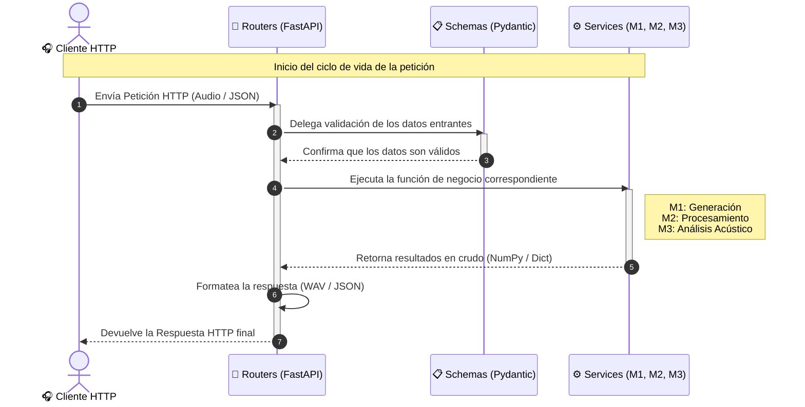

# RIR-API

API REST para procesamiento y analisis de respuestas al impulso segun la norma ISO 3382.

<!-- Badges -->


## Descripcion

RIR-API es un proyecto educativo que implementa una API REST (FastAPI) con una cadena
completa de procesamiento acustico: generacion de senales de excitacion, procesamiento
de respuestas al impulso por bandas de octava y calculo de parametros acusticos
(EDT, T20, T30) segun la norma ISO 3382-1.

## Integrantes

- Pellegrino, Salvador - Legajo: 75978 - Rol: Backend / API
- Castrillo, Lautaro - Legajo: 70558 - Rol: Procesamiento de señales
- Maiolo, Ivan - Legajo: 76593 - Rol: Testing / Documentación


## Requisitos previos

- Python 3.12 o superior
- [uv](https://docs.astral.sh/uv/) (gestor de paquetes y entornos virtuales)

## Instalacion

```bash
# Clonar el repositorio
git clone https://github.com/lautcast/trabajo_de_SyS.git
cd trabajo_de_SyS
```

### Creacion del entorno virtual e instalacion de dependencias

```bash
uv sync
```

## Ejecucion

```bash
# Iniciar la API con hot-reload
uv run uvicorn app.main:app --reload

# O usando el modulo directamente
python -m app.main
```

La API estara disponible en `http://localhost:8000`. 

Documentacion interactiva en:
- Swagger UI: `http://localhost:8000/docs`
- ReDoc: `http://localhost:8000/redoc`

## Estructura del proyecto



## Milestones

### M0 — Setup del entorno
**Fecha:** Semana 5

- [x] Hacer fork del repositorio template.
- [x] Clonar el fork y verificar que el entorno se instala correctamente.
- [x] Ejecutar la API: `uvicorn app.main:app --reload`.
- [x] Verificar que `/health` responde correctamente.
- [x] Ejecutar los tests (todos deben fallar con `NotImplementedError` excepto los de API).
- [x] Verificar que el CI funciona en GitHub Actions.

### M1 — Generacion de senales
**Fecha:** Semana 8

- [x] Implementar `generar_ruido_rosa()` en `app/services/pink_noise.py`.
- [x] Implementar `generar_sine_sweep()` en `app/services/sine_sweep.py`.
- [ ] Implementar `reproducir_y_grabar()`.
- [ ] Todos los tests de `test_generacion.py` deben pasar.

### M2 — Procesamiento de senales
**Fecha:** Semana 12

- [ ] Implementar `cargar_audio()` en `app/services/signal_utils.py`.
- [ ] Implementar `obtener_ri_desde_sweep()` en `app/services/signal_utils.py`.
- [ ] Implementar `filtro_octava()` en `app/services/filter.py`.
- [ ] Implementar `a_escala_log()` en `app/services/signal_utils.py`.
- [ ] Implementar `sintetizar_ri()` para validacion.
- [ ] Todos los tests de `test_procesamiento.py` deben pasar.

### M3 — API REST y analisis de parametros acusticos
**Fecha:** Semana 15

- [ ] Implementar `integral_schroeder()` en `app/services/acoustic_parameters.py`.
- [ ] Implementar `regresion_lineal()` en `app/services/acoustic_parameters.py`.
- [ ] Implementar `calcular_parametros_acusticos()` en `app/services/acoustic_parameters.py`.
- [ ] Crear routers y schemas para exponer toda la funcionalidad como API REST.
- [ ] Todos los tests de `test_analisis.py` y `test_api.py` deben pasar.
- [ ] (Opcional) Implementar `metodo_lundeby()`.


### Estrategia de ramas

**Main** -> rama protegida

#Ramas de desarrollo de los git-issues divididas por cada Milestone:


# GUÍA RÁPIDA DE RAMAS PARA NUESTRO PROYECTO RIR-API


# M1: Generación 

- **feature/sine-sweep** # Issue #1
- **feature/ruido-rosa** # Issue #2
- **feature/test-distribucion** # Issue #3

# M2: Procesamiento 

- **feature/filtro-butterworth** # Issue #4
- **docs/rango-fc** # Issue #5
- **docs/test-senales-conocidas** # Issue #6
- **feature/cargar-audio** # Issue #7
- **feature/sintesis-rir** # Issue #8
- **feature/deconvolucion** # Issue #9
- **feature/escala-logaritmica** # Issue #10

# M3: Producto Final 

- **feature/suavizado-media-movil** # Issue #11
- **feature/integral-schroeder** # Issue #12
- **feature/regresion-lineal** # Issue #13
- **feature/parametros-iso3382** # Issue #14
- **feature/lundeby-RI** # Issue #15


# GUARDAR Y SUBIR MODIFICACIONES

```bash
git add .
git commit -m "...(#Nro de issue)"
git push


### Convencion de commits
- **feat**: nueva funcionalidad
- **fix**: corrección de errores
- **test**: pruebas
- **txt**: documentación

## Como correr los tests

```bash
# Ejecutar todos los tests
uv run pytest -v

# Ejecutar tests de un modulo especifico
uv run pytest tests/test_generacion.py -v

# Ejecutar tests de la API
uv run pytest tests/test_api.py -v

# Ejecutar tests con reporte de cobertura
uv run pytest --tb=short
```

## Como correr el linter

```bash
# Verificar estilo de codigo
uv run ruff check app/ tests/

# Corregir automaticamente lo que se pueda
uv run ruff check --fix app/ tests/

# Formatear el codigo
uv run ruff format app/ tests/
```

## Licencia

Este proyecto esta licenciado bajo la Licencia MIT. Ver el archivo `LICENSE` para mas detalles.

